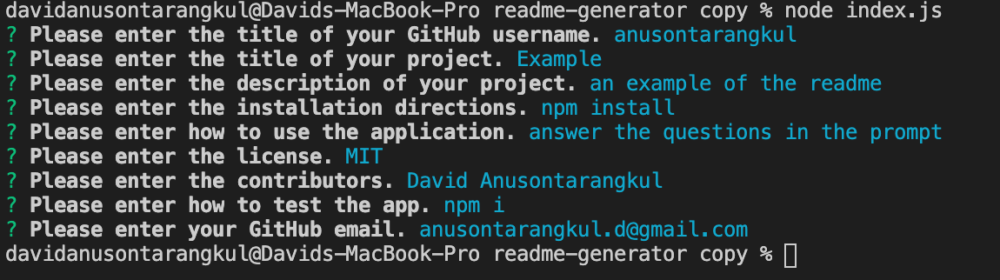

# README Generator 
[](https://github.com/anusontarangkul/readme-generator)
    
## Description

This is a node application that helps you generate a README.md.
    
## Table of Contents
    
* [Installation](#installation)

* [Usage](#usage)

* [License](#license)

* [Contributing](#contributing)

* [Tests](#tests)

* [Questions](#questions)
    
## Installation

To install the necessary dependencies and run the command:

```
npm i
```
    
## Usage

You will recieve prompts asking you for details about your application. Once you finish answering all of the questions, a README.md file will be added into your current folder with the appropriate information.



## License
            
This project is license under MIT.
   
## Contributors
    
David Anusontarangkul


[Github](https://github.com/anusontarangkul)
[LinkedIn](https://www.linkedin.com/in/anusontarangkul/)

## Tests

To test this project run the following command:

```
node index.js
```

## Questions

If you have any questions, please contact anusontarangkul at anusontarangkul.d@gmail.com.
